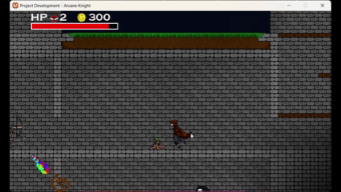
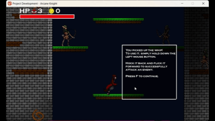
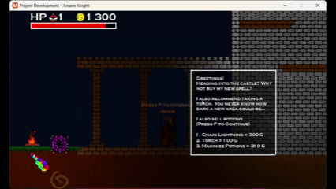
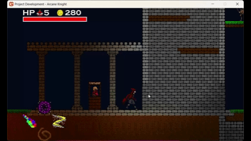
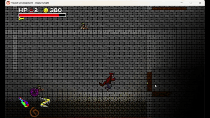
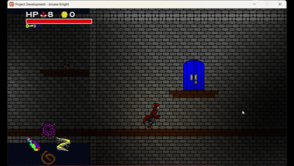
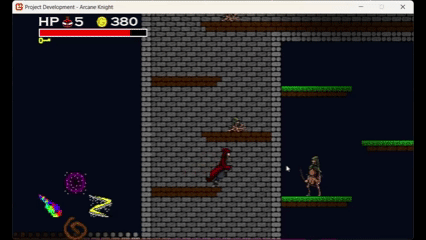

# Arcane Rogue

A 2D action dungeon crawler built in MonoGame (C#), featuring physics-driven combat, a multi-phase boss, dynamic lighting, and a hand-crafted world.

---

## Screenshots

---

## Gameplay

You play as a wizard exploring a haunted castle filled with skeletons, zombies, and ghosts. Fight your way through interconnected rooms, collect spell scrolls, spend gold at the vendor, and survive long enough to challenge the King Boss.

---

## Technical Highlights

### Verlet Integration — Whip Physics
The whip is simulated using Verlet integration across a chain of segments. Each frame, segment positions are updated based on their previous positions and velocity, then constrained iteratively to maintain segment length and simulate tension. Collision against the world geometry is resolved per-segment, and whip tip velocity is used to calculate hit force — a faster swing hits harder.

### Boss State Machine
The King Boss runs a fully custom state machine with distinct phases: idle floating, charge windup, charging, slam diving, slam impact, orb firing, and enemy summoning. Phase 2 triggers at half health, increasing aggression and adding radial orb spreads. Each state transition is driven by timers and cooldowns rather than simple distance checks, giving the boss a deliberate, readable attack rhythm.

### Dynamic Lighting
A custom HLSL shader drives a per-pixel lighting system. Multiple light sources (torches, the player's own light, environmental fires) are passed to the GPU each frame. The shader calculates distance and intensity falloff per pixel, producing soft, layered lighting across the dungeon.

### Save System
Game state is fully serialized to JSON on exit and restored on load — including player stats, inventory, enemy positions and health, doors, chests, scrolls, and vendor stock. The save file is stored in the user's Documents folder.

---

## Controls

| Action | Input |
|---|---|
| Move | A / D / Space |
| Whip | Left Click + Mouse Motion |
| Prismatic Missile | Q + Right Click |
| Lightning | E + Right Click and Drag |
| Teleport | Left Alt + Right Click |
| Interact | F |
| Pause | Escape |

---

## Running from Source

**Requirements:**
- Visual Studio 2022
- MonoGame 3.8+
- .NET 6 or later

**Steps:**
1. Clone the repository
2. Open the `.sln` file in Visual Studio
3. Restore NuGet packages
4. Build and run in Debug or Release

---

## Playable Build

A prebuilt Windows executable is available — [download here](https://mojavedweller.itch.io/arcane-rogue).

Extract the zip and run the `.exe` directly. No installation required.

---

## Built With

- [MonoGame](https://www.monogame.net/) — C# game framework
- HLSL — custom lighting shader
- System.Text.Json — save/load serialization
